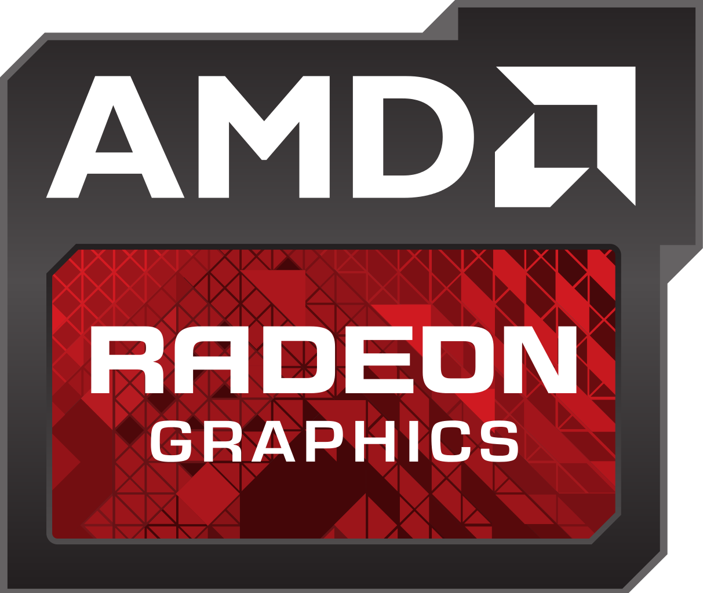

[TOC]

# DIY-PC

此项目用于DIY主机时，查询参数使用，欢迎大家提意见。别忘记 **star**。

## CPU 

### 什么是CPU ？

**NB**的名字叫**中央处理器**（英语：**Central Processing Unit**，缩写：**CPU**），是计算机的主要设备之一，功能主要是解释计算机指令以及处理计算机软件中的数据。

物理性来说，它就是一块集成了数量庞大的微型晶体管与其他电子组件的半导体集成电路芯片。

目前世界 **PC** 端的 **CPU** 主要由 **AMD** 和 **Intel** 两家垄断。

> 国内也一直在努力，相信设计是没有问题的，但是工艺还是达不到要求，仍需努力啊！

### Intel CPU

[Intel历史]()

[英特尔CPU产品列表](cpu/intel)

### AMD CPU

[AMD历史]()

[AMD CPU产品列表](cpu/amd)

## 显卡

### 什么是显卡？

**显示接口卡**（英文: **Video card**/**Graphics card**）、显示器配置卡简称为显卡，是个人电脑基本组成部分之一。 用途是将计算机系统所需要的显示信息进行转换驱动，并向显示器提供信号，控制显示器的正确显示，是连接显示器和个人电脑主板的重要元件。民用显卡芯片供应商主要包括**AMD**（原 **ATI**）和 **NVIDIA** (英伟达)两家。

### NVIDIA 显卡

[英伟达历史]()

[NVIDIA 显卡产品列表](gpu/nvidia)

### ATI 显卡

[ATI历史]()

## 主板

### 什么是主板？

### Intel CPU 主板

[Intel CPU配套主板](cpu/amd)

### AMD CPU 主板

[AMD CPU配套主板](cpu/amd)